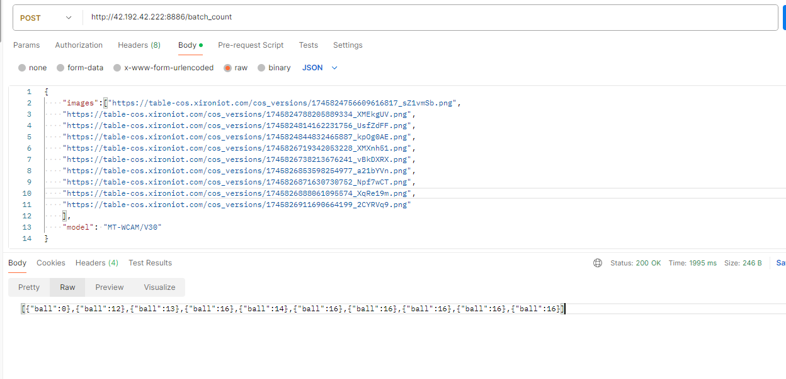

## 支持多batch推理的Triton服务

使用步骤：

1. **模型导出与TorchScript转换**

   ```bash
   python model_transformer.py
   ```

2. **部署NVIDIA Triton Inference Server**

   ```bash
   # 1. 安装Docker  
   sudo apt-get update  
   sudo apt-get install docker.io  
   
   # 2. 安装NVIDIA Container Toolkit  
   distribution=$(. /etc/os-release;echo $ID$VERSION_ID)  
   curl -s -L https://nvidia.github.io/nvidia-docker/gpgkey | sudo apt-key add -  
   curl -s -L https://nvidia.github.io/nvidia-docker/$distribution/nvidia-docker.list | sudo tee /etc/apt/sources.list.d/nvidia-docker.list  
   sudo apt-get update && sudo apt-get install -y nvidia-docker2  
   sudo systemctl restart docker  
   
   # 3. 验证GPU可用性  
   nvidia-smi  # 应显示GPU信息  
   ```

   

3. **Triton模型仓库配置**

```
# 1. 创建模型仓库目录结构  
mkdir -p model_repository/fcn_model/1  

# 2. 放置模型文件  
cp fcn_model.pt model_repository/fcn_model/1/model.pt  

# 3. 创建配置文件  
vim model_repository/fcn_model/config.pbtxt  
# 粘贴以下配置内容  

name: "fcn_model"
platform: "pytorch_libtorch"
max_batch_size: 32
input [
  {
    name: "input__0"
    data_type: TYPE_FP32
    dims: [ 3, 960, 960 ]
  }
]
output [
  {
    name: "output__0"
    data_type: TYPE_FP32
    dims: [ 1 ]
  }
]
dynamic_batching {
  max_queue_delay_microseconds: 1000
}
instance_group [
  {
    count: 2  # 每个GPU启动2个实例
    kind: KIND_GPU
  }
]

```

4. **启动Triton服务器**

启动triton inference server：

```bash
docker run -d --name=triton-prod --gpus=1 --cpus=4 --memory=16g --restart=unless-stopped -p8000:8000 -p8001:8001 -p8002:8002   -v $PWD/model_repository:/models -v /prod/logs:/var/log --log-driver=json-file --log-opt max-size=100m  --log-opt max-file=3 --security-opt=no-new-privileges --read-only --user 1000:1000   nvcr.io/nvidia/tritonserver:23.09-py3   tritonserver --model-repository=/models  --model-control-mode=explicit --load-model=fcn_model --http-thread-count=8 --repository-poll-secs=300 --log-verbose=0
```

检查容器状态 ：

```bash
docker ps -f name=triton-prod --format "table {{.ID}}\t{{.Status}}\t{{.Ports}}"
```

检查服务器状态（等待出现"READY"状态）  

```bash
curl -v localhost:8000/v2/health/ready 
```

检查模型加载状态  

```bash
curl localhost:8000/v2/models/fcn_model
```

 验证GPU访问  

```bash
docker exec triton-prod nvidia-smi -L  
```

5. **客户端测试（以公司的锁球器服务为例）**

已实现功能完整的main_sqq_triton.py，直接uvicorn启动或者pm2启动都可以：
uvicorn main_sqq_triton:app --host 0.0.0.0 --port 8886 --reload

输出结果示例：
